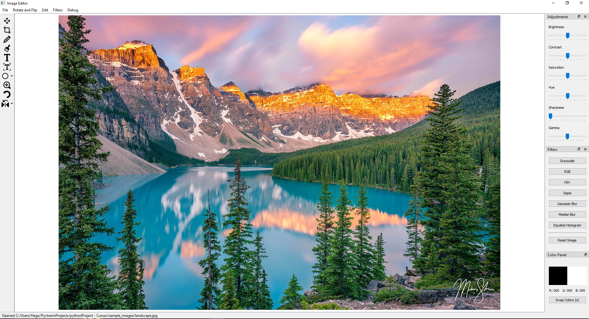
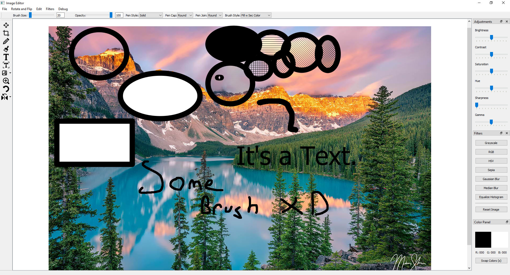
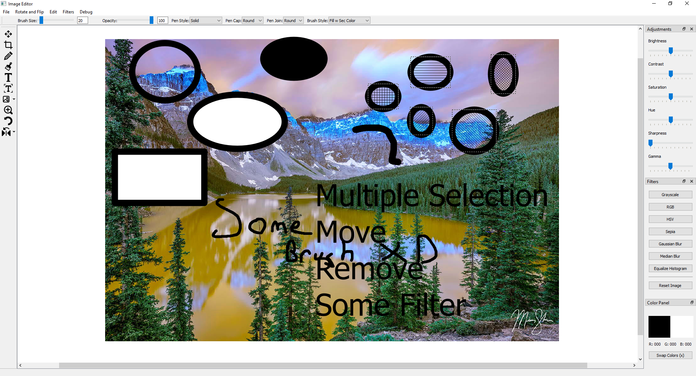

# PyQt5 Image Editor

A simple image editor application built with PyQt5 and OpenCV.



## Features

*   Open, save, and create new images (PNG, JPG, BMP) - including from clipboard.
*   Basic image viewing with smooth zoom and panning.
*   Drawing Tools:
    *   Brush with adjustable size and opacity.
    *   Text insertion with font selection.
    *   Shapes: Circle, Rectangle, Line (with pen style/cap/join options).
    *   *Pixmap insertion (partially implemented)*
    *   *Path drawing (partially implemented)*
    *   *Polygon drawing (partially implemented)*
*   Image Adjustments (Live Preview):
    *   Brightness, Contrast, Saturation, Hue, Sharpness, Gamma.
*   Image Filters:
    *   Grayscale, RGB, HSV, Sepia.
    *   Gaussian Blur, Median Blur.
    *   Histogram Equalization.
*   Image Operations:
    *   Flip (Horizontal, Vertical).
    *   Rotate (90° CW, 90° CCW).
    *   Crop.
*   Color Management:
    *   Primary/Secondary color selection with preview.
    *   Eyedropper tool.
    *   Color swap (X key).
*   Undo functionality for most image operations and drawing.
*   Movable/Selectable drawn items (Text, Shapes).
*   Debug panel for development insights (Ctrl+D).




## Requirements

*   Python 3.x
*   PyQt5
*   OpenCV-Python (`opencv-python`)
*   NumPy
*   *(Optional for profiling)* `line-profiler`, `snakeviz`

You can install the required packages using the `requirements.txt` file:

```bash
pip install -r requirements.txt
```

## Usage

1.  Clone the repository:
    ```bash
    git clone https://github.com/itshego/PyQtShop.git
    cd PyQtShop
    ```
2.  Install dependencies:
    ```bash
    pip install -r requirements.txt
    ```
3.  Run the application:
    ```bash
    python main.py
    ```

## Development

The application uses `cProfile` integrated into `main.py` for basic profiling. When the application closes, it saves profiling data to `profile_data.prof`. You can analyze this file using tools like `snakeviz`:

```bash
pip install snakeviz
snakeviz profile_data.prof
```

For more detailed line-by-line profiling, `line-profiler` is used on specific methods marked with `@profile` (currently in `CustomGraphicsView`). You might need to run it separately:

```bash
pip install line-profiler
kernprof -l -v custom_graphics_view.py # Or the specific file you want to profile
```

## Contributing

Contributions are welcome! If you'd like to contribute, please follow these steps:

1.  Fork the repository.
2.  Create a new branch (`git checkout -b feature/your-feature-name`).
3.  Make your changes.
4.  Commit your changes (`git commit -am 'Add some feature'`).
5.  Push to the branch (`git push origin feature/your-feature-name`).
6.  Create a new Pull Request.

Please ensure your code follows the existing style and add comments where necessary.

## License

This project is licensed under the MIT License - see the [LICENSE](LICENSE) file for details. 